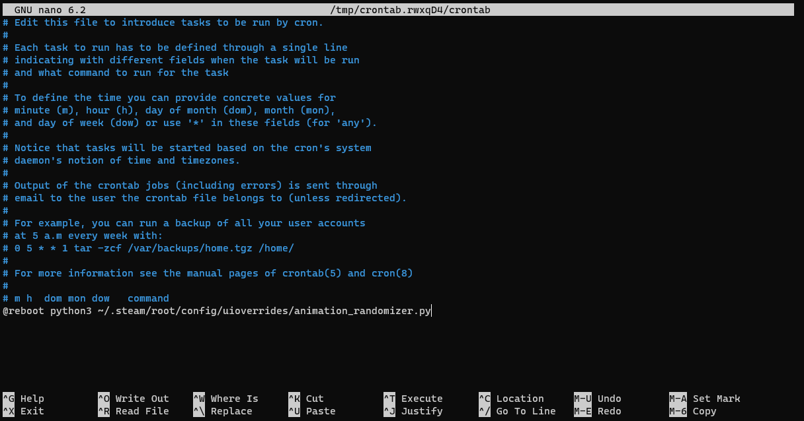

# Steam Deck boot movie/animation randomizer
| **Service** |                                                                                                            **Main**                                                                                                            |                                                                                                       **Dev**                                                                                                      |
|:-----------:|:------------------------------------------------------------------------------------------------------------------------------------------------------------------------------------------------------------------------------:|:------------------------------------------------------------------------------------------------------------------------------------------------------------------------------------------------------------------:|
|      CI     | [](https://github.com/JuanGomez12/steam_deck_boot/actions/workflows/python-test.yml) |[](https://github.com/JuanGomez12/steam_deck_boot/actions/workflows/python-test.yml) |
<!-- |             |                                                                                                                                                                                                                                |                                                                                                                                                                                                                    |
|             |                                                                                                                                                                                                                                |                                                                                                                                                                                                                    | -->

As the name implies, the idea is to create a randomizer for the boot animations.
# Instructions
Back up anything important in the ~/.steam/root/config/uioverrides/movies/ path if you have already set up movies there, just in case something doesn't work correctly!
## Manual Install
### Create folder for steam deck movies
Open a terminal and run:
```
mkdir -p ~/.steam/root/config/uioverrides/movies/
```
This will create the necessary directories that need to exist for us to move the scripts plus the directory on which to store the movies/animations.

### Copy the script to the directory
You can either copy the animation_randomizer.py script to the ~/.steam/root/config/uioverrides directory, or run:
```
curl https://raw.githubusercontent.com/JuanGomez12/steam_deck_boot/main/animation_randomizer.py -o ~/.steam/root/config/uioverrides/animation_randomizer.py
```

### Create cron job
Cron is a scheduling tool found in many different linux-based OSes, like Arch! We can use it so that every time the steam deck turns on, it automatically runs our animation_randomizer script and thus changes our startup movie.

To do this, we need then to open crontab using the terminal:
```
crontab -e
```
When you run this line, it will ask you to select a text processor to open cron. I'll assume we open it with nano, as it's a bit more newbie friendly.
Add the following line to the end of the wall of text that just showed up:
```
@reboot  python3 ~/.steam/root/config/uioverrides/animation_randomizer.py
```
It should look something like this:


Afterwards, press ctrl+x, press y to overwrite, and then press enter to save.

## Automatic installation
You should never run bash scripts from the internet blindly! However, I'll still offer an auto install that can be used by opening a terminal and typing:
```
curl https://raw.githubusercontent.com/JuanGomez12/steam_deck_boot/main/install_script | bash
```
This install script, found [here](install_script), runs the following commands which you can copy and paste in case you don't want to run a random file from the internet:
```
# Create Steam movies/animations folder
mkdir -p ~/.steam/root/config/uioverrides/movies/

# Delete steam_deck_boot folder if it exists in the tmp directory
rm -rf /tmp/steam_deck_boot

# Clone the repo
git clone https://github.com/JuanGomez12/steam_deck_boot /tmp/steam_deck_boot

# Run the cron job setup
python3 /tmp/steam_deck_boot/cron_setup.py

# Copy the randomizer to the uioverrides directory
cp /tmp/steam_deck_boot/animation_randomizer.py ~/.steam/root/config/uioverrides/

# Test to see if the script runs correctly
python3 ~/.steam/root/config/uioverrides/animation_randomizer.py
```
This will then setup everything so that the movie randomizer runs every time you turn on/reboot your steam deck.

## Add movies/animations
Add the animations to the ~/.steam/root/config/uioverrides/movies/ folder. Make sure that the animations' name ends with "startup" so that they can be recognized by the script!
## ...?

## Profit!
If you get any errors with any of the scripts, please let me know and I'll try to solve them as soon as I can. Hope it's useful for you!